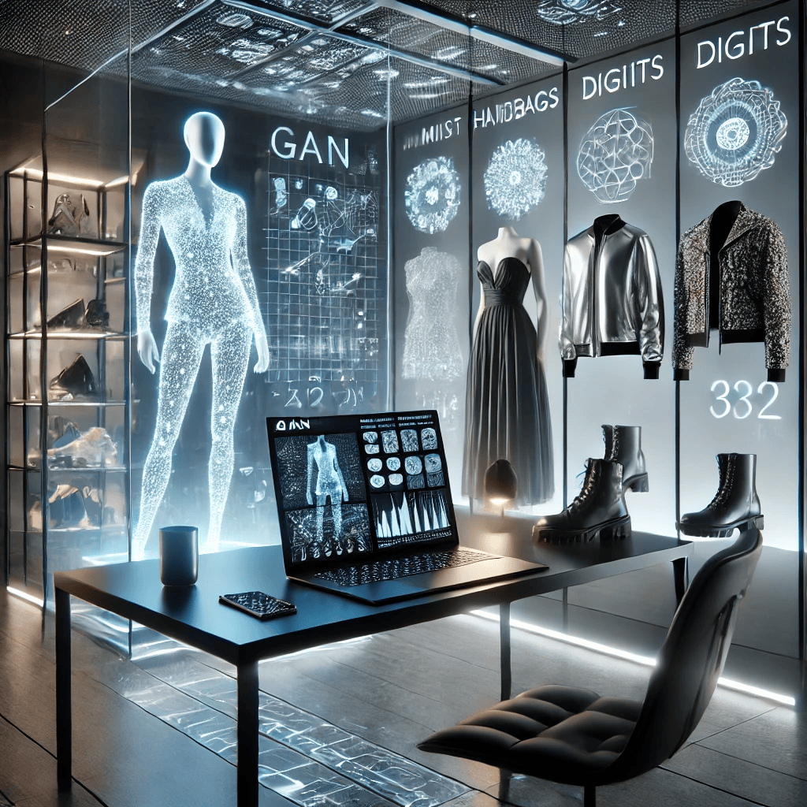

# Proyecto GAN para generación de imágenes

## Descripción del problema

El objetivo de este proyecto es desarrollar y entrenar una Red Generativa Adversaria (GAN) que permita generar imágenes a partir de un proceso de aprendizaje competitivo entre dos modelos: el generador y el discriminador. La GAN se entrena de forma que el generador aprenda a producir imágenes realistas, mientras que el discriminador mejora en distinguir entre imágenes reales y las generadas. Este enfoque es ampliamente utilizado en el campo del deep learning para la síntesis de imágenes, superresolución, transferencia de estilo, entre otros.

## Recursos incluidos

- **Cuaderno Jupyter/Colab:**  
  El código completo se encuentra en un cuaderno Jupyter, el cual está disponible en el repositorio y también puede ser ejecutado en Google Colab a través del siguiente enlace:  
  [Abrir en Google Colab](https://colab.research.google.com/drive/1esRxevXhHelIzfk-zVLULAuCTT9iFqCv?usp=sharing)

- **Modelos:**  
  Los archivos de los modelos entrenados se encuentran en la carpeta `models/`:
  - `generator.h5` – Modelo generador.
  - `discriminator.h5` – Modelo discriminador.

- **Imágenes generadas:**  
  Una muestra de las imágenes generadas se encuentra en la carpeta `img/` con el nombre `generadas.png`.
  

## Requisitos

- **Python 3.x**
- **TensorFlow/Keras**
- **Jupyter Notebook** o acceso a **Google Colab**
